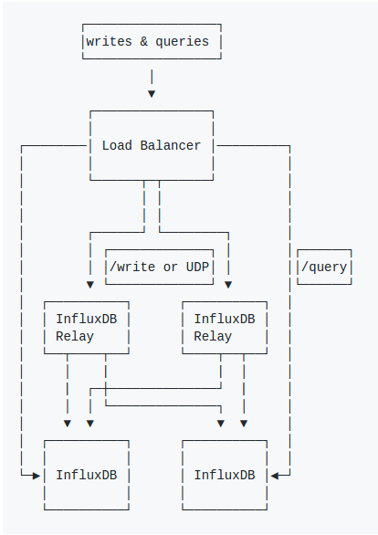

[InfluxDB](https://www.influxdata.com/) is a fast, horizontally scalable time-series database that is well-known used in real time analytics and IOT applications.
The enterprise version shows an impressive writing performance in [this experiment](https://blog.outlyer.com/time-series-database-benchmarks) where it can write up to 11 milions values per second
with 32 data nodes. It also offers a rich SQL-like query language and a HTTP API which is easy for integration. So we have a plan to make some benchmarks
with InfluxDB to see if choosing InfluxDB is a good move compared to our current database. This blog demonstrates our attempts to install and make InfluxDB scable (without using enterprise version)
on a Azure cluster powered by Kubernetes.

* TOC
{:toc}

## Install InfluxDB on a Azure cluster with Kubernetes

Why Azure and Kubernetes? At eSmart Systems we use Azure in most of our infrastructure components. [Kubernetes](https://kubernetes.io/) is a matured platform designed for automating deploying, scaling, operating
application containers and is currently used to deploy our time-series services. Deploying InfluxDB on the same cluster will reduce overhead communicating data across services and database.

Having an InfluxDB instance running on a Kubernetes cluster is as simple as running `kubectl run influx-db --image=influxdb`. However, because the persisted data is stored in `/var/lib/influxdb`
folder inside the container running inside a Pod (Pod concept [here](https://kubernetes.io/docs/concepts/workloads/pods/pod/)), it will be gone when that Pod is restarted. We might want to mount this folder somewhere, preferably a disk so that when a Pod 
dies, a new Pod created is able to load persisted data from the disk. This disk shouldn't be fixed with a host machine, otherwise a Pod initialized on a different machine can't find it. 
The best option is to use a separating disk that should be attached to alternative host machine in case the current attached host is corrupted. In our case, we use Azure Disk to do the job. A
complete set of driver volumes available for Kubernetes can be found [here](https://kubernetes.io/docs/concepts/storage/volumes/). 

After creating an Azure Disk, one can use this format to create a formula to mount it to Pods:

```
apiVersion: v1
kind: Pod
metadata:
 name: azure
spec:
 containers:
  - image: kubernetes/pause
    name: azure
    volumeMounts:
      - name: azure
        mountPath: /mnt/azure
 volumes:
      - name: azure
        azureDisk:
          diskName: test.vhd
          diskURI: https://someaccount.blob.microsoft.net/vhds/test.vhd
```

where `diskName` is the name of the VHD blob object and `diskURI` is the URI of the vhd blob object. After deploying,
Kubernetes deployment manager will first mount the disk to the node where the Pod created is supposed to run, then link
the specified path to that disk. One of nicest features about Kubernetes is self-healing, in case the node is down, the data
disk will be mounted to another node and new alternative pod is also created.

Now that we have one instance of running InfluxDB on a cluster, meaning we have one worker that handles reading and writing to 
an Influx database. What if we would like to have multiple Pods as multiple workers to interact with same data disk, is it possible
 to make InfluxDB scalable hence enhancing the speed of read/write operations?

## Attempt to make it scalable
The answer is possible but not by simply scaling the number of Pods. Let's say we create two more InfluxDB Pods using 
[`kubectl scale`](https://kubernetes.io/docs/tasks/run-application/horizontal-pod-autoscale/) to make it 3. So a Kubernetes service with a load balancer will distribute incoming requests across Pods in a round robin manner
based on their current resource. We experienced situation where we could use HTTP API to create tables in Influx but could not
retrieve them later. To see what is actually happening, we use [`kubectl exec`](https://kubernetes-v1-4.github.io/docs/user-guide/kubectl/kubectl_exec/) 
to execute read/write commands inside InfluxDB containers. The result shows that after initializing some data in a container,
we can actually see the data within the same container but can not see from other ones. Why can't a container see data written
by other containers? Don't containers write to same data disk? The reason must depend on the way InfluxDB store and query its data and
 index.
 
 According to [InfluxDB documentation](https://docs.influxdata.com/influxdb/v1.3/concepts/storage_engine/),  it uses an index table
 to provide quick mapping to measurements, tags and series. This index table plays a critical role in optimizing query speed of
 InfluxDB. However this table is only loaded to container's memory once at start-up time and will grow at every write operations.
Because of this design, one container's index table will be never aware of changes from another one's index table, therefore 
it won't be able to find newly added data. At the time I write this blog post, the newest version of InfluxDB, which is v1.3, 
offers the ability to store time series index to disks (it is still in memory by default). However even so, this will not completely 
help synchronize data across running containers. Queries to the storage engine will merge data
 from the Cache with data from the TSM files. While TSM files are stored as data blocks on disks, Cache is stored in memory
 and only pushed to disks when WAL (Write Ahead Log) is full. Hence an InfluxDB container can't see the Cache data from another
container. 

Due to the way InfluxDB works, the idea of using multiple processes to access to one database could be difficult to reach, 
if not impossible without using their Enterprise version. But how about we can have multiple servers hosting the same database
 and a load balancer will decide which server to execute a read or write operation. This is actually implemented in an open source project 
 named [influx-relay](https://github.com/influxdata/influxdb-relay).
 
 
 
 *Architecture of influx-relay*
 
 The image above describes architecture of influx-relay, it will return a success response as soon as one of InfluxDB servers
 return a success and return a 4xx response in case any of servers returns a 4xx response. This architecture offers a nice way
 to scale the availability of InfluxDB using multiple servers. It is even mentioned in official InfluxDB documentation version v0.12. We hope that it
 will be well maintained to adapt to changes for newer versions.

## Use acs-engine to create a more flexible Kubernetes cluster
 
It is obvious that the ideal solution for large-scale time series database with InfluxDB is its Enterprise version,
in aspects of both distributed storage and optimized writing or querying speed. But at the moment we would like to have some benchmark with one single
InfluxDB instance hosted on a virtual machine. Nice if we can compare stats later with Enterprise version when necessarily.
We use a premium Azure storage as data disk and as explained above, there should be only one InfluxDB instance running to connect to the disk.
 The disk also needs to be configured to always attach to the a performance node where the disk is mounted.

Fist we need a Kubernetes cluster in Azure cloud. This is relatively simple with [one line of command using Azure CLI](https://docs.microsoft.com/en-us/azure/container-service/kubernetes/container-service-kubernetes-walkthrough).
But there are some limitations with this cluster where the default number of agents is 3 and the default size is Standard_D2_V2 which
has only two cores and 7 GiB of RAM. Azure constraints high performance storage, i.e SSD, can only be mounted to some also high performance
virtual machines, i.e DS-series or GS-series. So it would be the best if we can have a cluster with mixed types of virtual machines
for different purposes. The only possible way to do that is to use [Azure Container Service Engine](https://github.com/Azure/acs-engine), or
acs-engine for short. acs-engine generates ARM (Azure Resource Manager) templates for Docker enabled clusters on Microsoft Azure with choices of
DS/OS, Kubernetes or Swarm orchestrators. With ARM, we can create multiple agent pools with different VM sizes, nodes count, etc. 
 
To deploy a cluster, follow steps in *Generating a template* section of [Azure Container Service Engine document](https://github.com/Azure/acs-engine).
We need to have `servicePrincipalClientID` and `servicePrincipalClientSecret` to fill in the file *examples/classic/kubernetes.classic.json*,  
Note that the url to resource group should be found in Azure portal navigating to that resource group.

To update the cluster, e.g adding more nodes, modify  *_output/analytics-kuber-1/apimodel.json* and run 
```
./acs-engine generate _output/analytics-kuber-1/apimodel.json
``` 
to generate *azuredeploy.json* and *azuredeploy.parameters.json*, then execute this command
```
az group deployment create --name analytics-kuber-deploy-1 
                           --resource-group analytics-kuber-resource-1 
                           --template-file "./_output/analytics-kuber-1/azuredeploy.json" 
                           --parameters "./_output/analytics-kuber-1/azuredeploy.parameters.json
```
 where analytics-kuber-deploy-1 is the cluster name and analytics-kuber-resource-1 is the resource group name. In the final step,
 we make our InfluxDB configuration file so that its Kubernetes Pods will be always created on a certain premium node , using [node labels](https://kubernetes.io/docs/concepts/configuration/assign-pod-node/).    
 
## Conclusion
 
 In this blog post, we demonstrate how we install InfluxDB on a cluster of virtual machines in Azure powered by Kubernetes. Our attempt
 in making it scalable with multiple Pods does not work because InfluxDB storage engine is not designed to scale that way. If one does not want
 to stick with Premium version, influx-relay could be a considerable option. Otherwise, try to install InfluxDB on a high performance machine
 and do some benchmark to see how it satisfies your need. Its speed might surprise you as it does to me :-)
 
 

