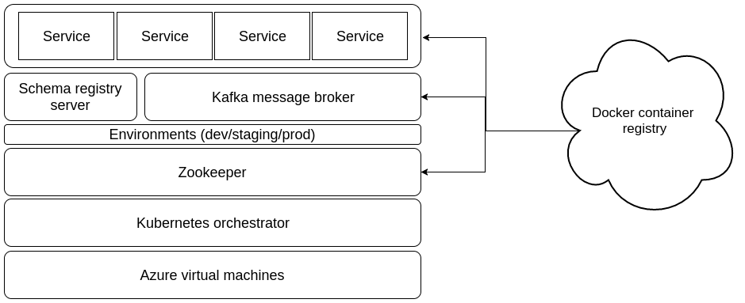

<h4>Table of Contents</h4>
* TOC
{:toc}

# Context
My recent task was to design and build a general purpose platform to host analytics services, which could be possibly different kinds
of services, i.e prediction, monitoring, performance tracking, logging, etc. So I have had a chance to take a close look into 
microservices architecture. While microservices is not a new term to me, it floats over many technical articles and I also
have experience working with Akka actor system with jvm in my previous job, this task requires me a wider and sharper understanding of
microservices in general so that I can pick which technology stack best suits our scenario. This blog post summarizes what I have
gone through to come up with the architecture and I hope it would help readers who have similar interest.


Let's start with what a microservices system is. This is really a broad term which can relate to many other terms, but one can
find a complete set of definitions for components of microservices in [this article](https://martinfowler.com/articles/microservices.html)
by Martin Fowler. I have seen many sources referring to this great article/book, a great starting point. In my view and specific
use case, I would like to have these key features:

1. Easy to scale: we should be able to increase/decrease number of instances of each service easily if required.
2. Self healing: a plan to recover when one service's instance is down or when a host machine is down.
3. Environments: a service needs to go through a few temporal environments before going live (or production).
4. Version control: to rollback if necessary.
5. Support synchronous and asynchronous

The first four are standard requirements for a microservices system. And they are all solved if we use a cluster orchestrated by
[Kubernetes](https://kubernetes.io/). There are many more exciting things about Kubernetes that can reduce a lot of workload
for DevOps engineers. By choosing Kubernetes as the first layer in our infrastructure stack, we can spend more resources on
building complex logic layer among services on top. Now, this part is more exciting w.r.t architectural view. Let's say
we would like to have connections between services, and furthermore a connection could be either a request-and-respond pattern or a
fire-and-forget pattern. A very interesting presentation on this can be found on slideshare [here](https://www.slideshare.net/ewolff/rest-vs-messaging-for-microservices).
So at this point, there is one more requirement a microservices system must have to allow flexible services' dependencies, which
is the fifth requirement with synchronous and asynchronous concepts. This is actually the decisive point that differentiates systems' architecture. 
Following I will explain more about synchronous and asynchronous operations and discuss options I can consider for this feature.
 


# Synchronous and asynchronous
So what is synchronous? Basically synchronous(sync) means ordering, first come first serve. A request needs to be completed before
the next one is processed. There are many examples for synchronous operations. Whenever you login to a website,
you have to wait until its server verifies your account and sends feedback to your browser, before you can do other tasks.
That's called synchronous. Sometimes you will hear people mentioning blocking operations, that's synchronous too.
 On the other hand, asynchronous(async) means non-blocking, so that a task does not have to wait for long time for
the previous task to finish to be executed. One example is when you register a new account, a verification email is sent to your mailbox
 asynchronously without you having to wait for it.

Based on sync and async tasks, typically there are two kind of services. First one is request and response kind of service.
A service in this group usually expects a response after sending out a request. It can be implemented in a sync or async way.
While sync is trivial, to implement async request/response operations, we could use threading where each request waits for
its response in its own thread. But multi-threading programming is complicated, error prone and users have to deal with quite many issues,
e.g race-conditions, dead-locks, etc. Another way, which is better, is to use CPU context switching, meaning that CPU keeps
switching between contexts(threads) then triggers some callback function when the response arrives. That set of contexts is often referred
as events loop or coroutines. A nice illustration for async callback function that I pick up from [this article](https://hackernoon.com/asynchronous-python-45df84b82434) is:

>a callback is like when you call a customer service line, and immediately leave your number and hang up, 
>so they can call you back when they are available, rather than having to wait on hold forever.

In Python, there are a few libraries that supports callback style async, two of most popular ones are [Tornado](http://www.tornadoweb.org/en/stable/guide/async.html)
and [gevent](http://www.gevent.org/). With more and more interest in async programming, Python 3.5 eventually has a built-in library named
[asyncio](https://docs.python.org/3/library/asyncio.html) which supports async methods, that returns a coroutine to be awaited.

Another kind of service is fire and forget. As suggested by the name, services in this group don't care about the response when firing a request,
except for some acknowledgement sometimes. In most scenarios, a service receives input from a message queue, processes and produces the result to
another queue which will be consumed further by other services. We usually see fire and forget services in streaming applications that 
pass messages through the whole system in real time.

In our use case, we need to have both kinds of service. There will be services that return response to the caller and there will be ones forwarding
results to downstream services after processing. Furthermore, some of our services need to be exposed to external network
 along with API while the rest only need to execute their own logic and the results will be used later. A variety of frameworks and protocols
 are taken into account.
 
# Rest vs messaging
Following recent trends for microservices systems, there seems to be two main protocols for inter communication among services:
REST and messages driven. Actually, REST is the first thing pop up on our head when thinking about the service itself.
 In Python it is relatively easy to use [Flask](http://flask.pocoo.org/) framework to wrap a service with Swagger API. For a
 good combination of REST and Swagger, we recommend [this connexion package](https://github.com/zalando/connexion) from Zalando.
 It allows us to write API separately without code generating and supports async operations with [Tornado](http://www.tornadoweb.org/en/stable/).
  Obviously REST is made for request and response models, but there are some other things we need to consider:

- Synchronous by default. We need additional resources to make services async and this needs to be done at service level.
 A load balancer will be also essential for async tasks. 
- Not made for fire and forget model. So it is not a wise choice in streaming systems.
- In [this blog post](https://engineeringblog.yelp.com/2016/07/billions-of-messages-a-day-yelps-real-time-data-pipeline.html)
   by Yelp engineers, they shows that implementing RESTful HTTP connections between every pair of services scales poorly. 
   HTTP connections are usually implemented in an ad hoc way, and they are also almost exclusively omni-directional.  
- A change in API will require changes in upstream callers. It is sometimes difficult to track which services to change.

A system powered by a message broker addresses most of above concerns. In its simplest form, a message broker accepts and forwards message.
It fits naturally with fire and forget model, also supports async mechanism. With the broker message standing in between, a publisher and a consumer are decoupled, meaning that
 the two do not have to know about each other's status. Making a service independent on other services is actually an important 
 aspect in of microservices' architecture. Other than those, the broker is also a load balancer, takes care of message resilience
 in case of failures, etc. It relieves load of work and make services focus only on their own execution logic. The only downside
 for systems powered by a message broker is how to handle request/respond kind of service. This can be solved by using correlation id
 for matching caller id to the response although this is quite ad hoc and not too direct. Following is a code sample using RPC from Rabbit MQ tutorial
 to implement a trigger function at server side for request and response model.
 
```python
def on_request(ch, method, props, body):
    n = int(body)

    print(" [.] fib(%s)" % n)
    response = fib(n)

    ch.basic_publish(exchange='',
                     routing_key=props.reply_to,
                     properties=pika.BasicProperties(correlation_id = \
                                                         props.correlation_id),
                     body=str(response))
    ch.basic_ack(delivery_tag = method.delivery_tag)
```
 
While REST and Swagger(Open API) is a good combination for exposing services to external world, messages broker offers the ability
 to decouple services and ensure messages throughput as well as their resilience. Our system eventually contains both kind of services depending
 on the requirements, with an option to make a REST service sending message to a broker also. Two of most popular broker
 frameworks which have Python client are [Rabbit MQ](https://www.rabbitmq.com/) and [Kafka](http://kafka.apache.org/documentation.html#quickstart), 
 so how do we decide which one to use in our case? 
 
 
# Rabbit MQ vs Kafka
With 10 years since the first release and 35000 production deployments world-wide, Rabbit MQ is really a matured message 
broker platform. It supports multiple message platforms including AMQP, STOMP, MQTT, etc. Its client in Python
is [Pika](https://github.com/pika/pika). To handle request and respond kind of service, Rabbit MQ uses Remote Procedure Call (RPC)
which is a blocking(sync) remote message protocol and a `reply_to` queue from a receiver to a sender. Then to make it async,
a `correlation_id` is sent along to filter which request a response is for.

However after some references, we pick Kafka as our message broker system to deploy on a Kubernetes cluster. Here is why:
+    A topic is distributed across multiple partitions. Hence it is scalable and allows fault-tolerance. Each consumer in
a consumer group subscribes only one partition to make sure the order of messages processed. This feature is crucial in
streaming or real time applications. 


*Kafka log anatomy (from [Apache Kafka](http://kafka.apache.org))*

+    Kafka run on top of Zookeeper which is a centralized service for maintaining configuration information, naming,
providing distributed synchronization, etc. Many of Hadoop solutions depend on Zookeeper so it is good to get used to
Zookeeper before using HBase or Spark.

+   Message is the communication unit here. A topic's subscriber needs to know format of the message sent by some publisher
to be able to parse and process it. What happens when that format changes and every downstream subscribers crash? How can a 
 service find the updated format and adapt accordingly? This could be very problematic when we have a big system with lot
 of dependencies as pointed in [Yelp's use case](https://engineeringblog.yelp.com/2016/08/more-than-just-a-schema-store.html).
 Kafka has a nice solution for this problem with its [Schema Registry](https://github.com/confluentinc/schema-registry).
 This is a server deployed in same cluster with Zookeeper and Kafka, acts as a REST service storing and managing all the versions of messages
 in every topics. Schema is written in [Avro](https://avro.apache.org/docs/1.8.1/spec.html) format that allows schema evolution.
 This way is to ensure publishers and consumers can still work with their current message values even the format is updated as long as
 it is valid against evolution. This is an unique and awesome feature about messages broker that I could not find anywhere.
 
Besides, Kafka eco-system offers a wide range of libraries that helps connect with external system such as databases (Kafka Connect),
or for building highly scalable, distributed streaming applications (Kafka Streams). The interest in Kafka has grow big
during the time and it is expected to be a powerful framework for streaming as well as messages broker soon. We use [confluent-kafka-python](https://github.com/confluentinc/confluent-kafka-python)
for sending/receiving messages as well as validating messages with schema registry.

# Final architecture
To conclude this blog post, we introduce our infrastructure architecture for microservices. 


*Our microservices architecture*


It has two main components. First is a docker container registry that hosts all our docker images for every kind of services and infrastructures such as Zookeeper,
Kafka or schema registry server. The other component demonstrates our stack with five layers. Base layers include a cluster
of Azure virtual machines powered by Kubernetes. On top of that we have Zookeeper running for managing configuration and routing.
Next is the environment layer which is essential to separate stages during deployment process, usually they are development,
staging and production environments. Then comes schema registry server and Kafka message broker layer, that serves the top most layers
which is services layer. We can scale services to multiple instances each depending on need easily with Kubernetes.

